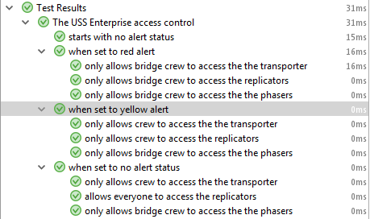

# JUnit 4 &rarr; JUnit 5

----

# Maven Dependencies

## JUnit 5 pure
```xml
<dependency>
  <groupId>org.junit.jupiter</groupId>
  <artifactId>junit-jupiter-engine</artifactId>
  <scope>test</scope>
</dependency>
```

## JUnit 4 compat

```xml
<dependency>
  <groupId>org.junit.vintage</groupId>
  <artifactId>junit-vintage-engine</artifactId>
  <scope>test</scope>
</dependency>
```

- Kann problemlos parallel benutzt werden, so wie es ausschaut...
- Etwas unklar, ob man noch mehr braucht...

----

# Was hat sich geändert (Jupiter)?

- `@BeforeClass` &rarr; `@BeforeAll`
- `@AfterClass` &rarr; `@AfterAll`
- `@Before` &rarr; `@BeforeEach`
- `@After` &rarr; `@AfterEach`
- `@Ignore` &rarr; `@Disabled`
- `@Category` &rarr; `@Tag`
- Class/Method muss nicht mehr `public` sein
- `assertThat` removed &rarr; Hamcrest

----

# Was ist neu in JUnit 5
## Test for Exceptions

```java
@Test
void shouldThrowException() {
  Throwable exception = assertThrows(
    UnsupportedOperationException.class, 
    () -> {
      throw new UnsupportedOperationException(
        "Not supported");
    }
  );
    
  assertEquals(
    exception.getMessage(), 
    "Not supported");
}
```

----

# Was ist neu in JUnit 5
## Display Names

```java
@DisplayName("The USS Enterprise access control")
class AccessControllTest {
  @Test
  @DisplayName("starts with no alert status")
  void noAlertStatus() { ... }
  
  @Test
  @DisplayName("when set to yellow alert")
  void yellowAlert() { ... }
  
  ...
}
```
----

# Was ist neu in JUnit 5
## Display Names



In Kombination mit "Nested Tests".

----

# Was ist neu in JUnit 5
## Parameterized Tests

```java
@ParameterizedTest
@ValueSource(strings = { "racecar", "radar" })
void palindromes(String candidate) {
  assertTrue(isPalindrome(candidate));
}
```

- CSV, Enums etc. pp.
- <https://junit.org/junit5/docs/current/user-guide/#writing-tests-parameterized-tests>

----

# Was ist neu in JUnit 5
## Grouped Assertions

```java
@Test
void canAccessPhasers() {
  assertAll(
    () -> assertTrue(sut.canAccessPhasers(picard)),
    () -> assertFalse(sut.canAccessPhasers(barclay)),
    () -> assertFalse(sut.canAccessPhasers(lwaxana)),
    () -> assertFalse(sut.canAccessPhasers(q))
  );
}
```

Bricht nicht beim ersten fail ab, sondern führt alle Assertions aus.

----

# Was ist neu in JUnit 5
## `@RunWith` , `@Rule` and `@ClassRule`

No direct replacement, they have been superseded by `@ExtendWith` and there is limited rule support in `junit-jupiter-migrationsupport`.

----

# Was ist neu in JUnit 5
## Mockito Rule

```java
@ExtendWith(MockitoExtension.class)
class MockTest {
  @Mock
  Foo foo;
}
```

----

# Was ist neu in JUnit 5
## Rules

- Gibt es so nicht mehr &rarr; Extensions
- Aber einige Rules sind auch in Jupiter noch da
	- `ExpectedException`
	- `ExternalResource`
	- `TemporaryFolder`
	- `Verifier`
- Braucht _org.junit.jupiter:junit-jupiter-migrationsupport_

----

# Was ist neu in JUnit 5
## Rules

```java
@EnableRuleMigrationSupport // <- IMPORTANT!
class FooTest {

  @Rule
  public final TemporaryFolder tmp = 
    new TemporaryFolder();

  @Test
  void foo() {
    final Path root = tmp.getRoot().toPath();
    assertThat(root, is(not(nullValue())));
  }
}
```

----

# Q&A

There is a lot more stuff:

- <https://junit.org/junit5/docs/current/user-guide>
- <https://github.com/junit-team/junit5-samples>